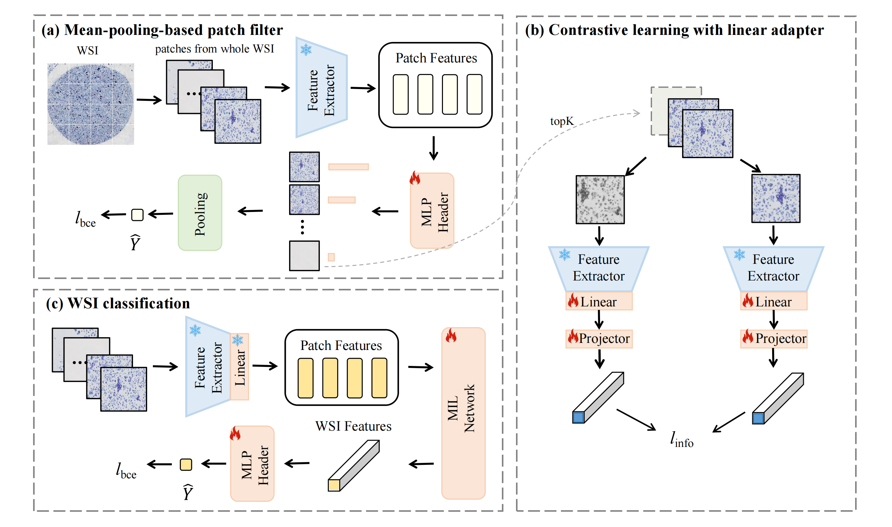
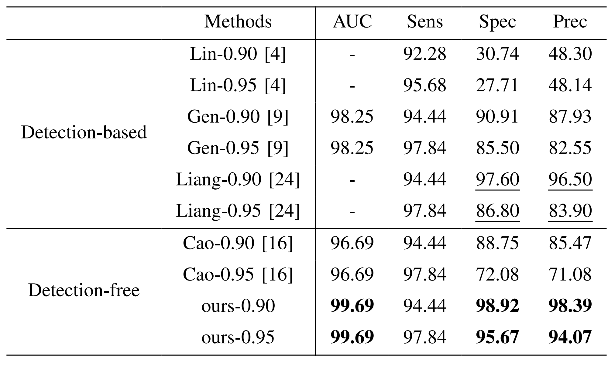

# TCT-InfoNCE


## An efficient framework based on large foundation model for cervical cytopathology whole slide image classification

[[`Model`](#wait)] [[`Paper`](#wait)] [[`BibTeX`](#wait)]


## Model Overview

<p align="center">
     <br>
</p>

## Install

On an NVIDIA Tensor Core GPU machine, with CUDA toolkit enabled.

1. Download our repository and open the TCT-InfoNCE
```
git clone https://github.com/CVIU-CSU/TCT-InfoNCE.git
cd TCT-InfoNCE
```

2. Requirements

```bash
conda create -n biomed python=3.8
conda install pytorch==1.12.1 torchvision==0.13.1 torchaudio==0.12.1 cudatoolkit=11.3 -c pytorch
pip install open_clip_torch==2.23.0 transformers==4.35.2 matplotlib
pip install h5py scikit-learn==0.22.1 future==0.18.3
pip install wandb==0.15 torchsummary==1.5.1 torchmetrics
pip install einops chardet omegaconf
pip install jupyter
```


## Results and Models

- **Result**

<p align="center">
     <br>

- **Model Download**
The models and gc-features can be accessed from [Baiduyun](https://pan.baidu.com/s/1iY9U4UzX-lusHYCQN7fwTw?pwd=5367)

## Train
The CSD dataset labels are based on the WSI as the fundamental unit, and the details can be found in the `datatools` folder.


The training process consists of three stages: filtering patches, training adapter, and training the MIL method. The subsequent process is specifically tailored for the `PLIP` foundation model in conjunction with the `MHIM(TransMIL)` approach.
 
- **Filter patches**
```bash 
# extract patch features use the frozen image encoder

cd extract-features
GPU_NUMBERS=4
FEAT_DIR='clip1-test'
WSI_ROOT='/home1/wsi/gc-224'
OUTPUT_PATH='result-final-gc-features'
python -m torch.distributed.launch --nproc_per_node=$GPU_NUMBERS extract_features_tct.py --base_model=clip --dataset=gc --output_path=$OUTPUT_PATH --feat_dir=$FEAT_DIR --wsi_root=$WSI_ROOT --ckp_path=$CKP_PATH --multi_gpu --batch_size=32 --num_workers=64
---------------------------------------------

# train patch classifier
cd mil-methods/scripts
bash meanmil.sh clip1-test gc 512
---------------------------------------------

# filter patches
cd mil-methods
FEAT_DIR=clip1-test
K=50

OUTPUT_ROOT=/home1/wsi/gc-output-filter/$FEAT_DIR-meanmil-$K
FEATURE_ROOT=../extract-features/result-final-gc-features/$FEAT_DIR
WSI_ROOT=/home1/wsi/gc-224
TRAIN_LABEL=../datatools/gc/labels/train_val.csv
CKP_PATH=./output-model/mil-methods-info/$FEAT_DIR-meanmil-gc-trainval/fold_0_model_best_auc.pt
python inference-multi.py --input_dim=512 --datasets=gc --feature_root=$FEATURE_ROOT --wsi_root=$WSI_ROOT --output_root=$OUTPUT_ROOT --train_label=$TRAIN_LABEL --ckp_path=$CKP_PATH --topk_num=$K  --model=meanmil
```

- **Train adapter**
```bash 
cd extract-features
BACKBONE=clip
K=50

DATA_DIR=/home1/wsi/gc-output-filter/clip1-test-meanmil-${K}
TRAIN_LABEL=../datatools/gc/labels/train_label.csv
PROJECT_NAME=simclr-infonce
OUTPUT_PATH=output-model
TITLE_NAME=${BACKBONE}_simclr_infonce_filterGC_${K}_224_4*256
python -m torch.distributed.launch --nproc_per_node=4 simclr.py --ddp --dataset=gc --backbone=$BACKBONE --data_dir=$DATA_DIR --train_label_path=$TRAIN_LABEL --project=$PROJECT_NAME --model_path=$OUTPUT_PATH --title=$TITLE_NAME --workers=2 --seed=2024 --batch_size=256 --epochs=200 --wandb
```

- **Train MIL**
```bash 
# extract patch features use the trained image encoder
cd extract-features

GPU_NUMBERS=4
FEAT_DIR=clip3-test
WSI_ROOT='/home1/wsi/gc-224'
OUTPUT_PATH='result-final-gc-features'
CKP_PATH=./output-model/simclr-infonce/clip_simclr_infonce_filterGC_50_224_4*256_200/clip_simclr_infonce_filterGC_50_224_4*256_200_epoch200.pt
python -m torch.distributed.launch --nproc_per_node=$GPU_NUMBERS --master_port=12345 extract_features_tct.py --base_model=clip --dataset=gc --output_path=$OUTPUT_PATH --feat_dir=$FEAT_DIR --wsi_root=$WSI_ROOT --ckp_path=$CKP_PATH --with_adapter --target_patch_size 224 224 --multi_gpu --batch_size=32 --num_workers=64
---------------------------------------------

# train TransMIL
cd mil-methods/scripts
bash transmil.sh clip3-test gc 512
# train MHIM-MIL(TransMIL)
bash mhim\(transmil\).sh clip3-test gc 512

```

## Test

You can extract the features with our weights and train MIL methods.

The adapter modules' weights can be accessed from [adapters](https://pan.baidu.com/s/1iY9U4UzX-lusHYCQN7fwTw?pwd=5367).

```bash
# Extract feature
cd extract-features

GPU_NUMBERS=4
FEAT_DIR=clip3-test
WSI_ROOT='/home1/wsi/gc-224'
OUTPUT_PATH='result-final-gc-features'
CKP_PATH=./output-model/simclr-infonce/clip_simclr_infonce_filterGC_50_224_4256_200/clip_simclr_infonce_filterGC_50_224_4256_200_epoch200.pt
python -m torch.distributed.launch --nproc_per_node=$GPU_NUMBERS --master_port=12345 extract_features_tct.py --base_model=clip --dataset=gc --output_path=$OUTPUT_PATH --feat_dir=$FEAT_DIR --wsi_root=$WSI_ROOT --ckp_path=$CKP_PATH --with_adapter --multi_gpu --batch_size=32 --num_workers=64

# MIL
# train TransMIL
cd mil-methods/scripts
bash transmil.sh clip3-test gc 512
# train MHIM-MIL(TransMIL)
bash mhim\(transmil\).sh clip3-test gc 512
```

Or you can just eval our method by downloading the WSI features and MIL methods' weights.

The mil methods' weights and features extracted by clip-SimCLR can be accessed from [mil](https://pan.baidu.com/s/1iY9U4UzX-lusHYCQN7fwTw?pwd=5367) and [gc-features](https://pan.baidu.com/s/1iY9U4UzX-lusHYCQN7fwTw?pwd=5367), and should be put in the corresponding folder.
```bash
cd mil-methods
FEATURE_NAME=clip3
DATASET=gc
NUM_DIM=512

DATASET_PATH=../extract-features/result-final-$DATASET-features/$FEATURE_NAME
LABEL_PATH=../datatools/$DATASET/labels
OUTPUT_PATH=output-model
PROJECT_NAME=mil-methods-info

CHECKPOINT_PATH=$OUTPUT_PATH/$PROJECT_NAME/$FEATURE_NAME-mhim\(transmil\)-$DATASET-trainval

CUDA_VISIBLE_DEVICES=0, python3 eval.py --label_path=$LABEL_PATH  --dataset_root=$DATASET_PATH --ckp_path=$CHECKPOINT_PATH --datasets=tct --input_dim=$NUM_DIM --model=pure --baseline=selfattn --seed=2024 

```

## Acknowledgements


## Citation
